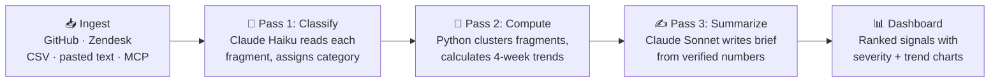

<div align="center">

# Noiseglass

### Cut through the noise. See the real signal.

**[Live demo → noiseglass.vercel.app](https://noiseglass.vercel.app)**


</div>

---

## What is this?

**The short version:** hand Noiseglass any pile of raw text — support messages, GitHub issues, pasted notes, whatever — and it tells you *"here are the 5 problems that actually matter, ranked, with the numbers to prove it."*

**The slightly longer version:** every team drowns in unstructured feedback. A hundred people say the same thing a hundred different ways ("app crashed", "keeps freezing", "won't open since update"), and the one genuinely urgent issue is buried under praise, spam, and vague complaints. Noiseglass reads all of it, groups fragments that describe the same underlying problem, counts how each problem is trending week over week, and writes a short brief for each one: what's happening, how bad it is, and what to do next.

The core unit isn't a "support ticket." It's a **fragment**: any scrap of raw text, source-agnostic by design. That's what makes Noiseglass work for more than one job: a support lead pointing it at a help desk export, a recruiter pasting interview panel notes, a client dropping in meeting notes, or an AI agent handing it a pile of logs over MCP. If it's text, Noiseglass can turn it into signal.

## The core idea: AI reads, code counts

Most AI analytics tools have a trust problem: if you ask a language model "how many complaints did we get about billing?", it will give you a confident number that may be completely made up. LLMs are brilliant at reading and terrible at arithmetic.

Noiseglass splits the job by strength:

| Task | Who does it | Why |
|------|-------------|-----|
| Read messy human text and say what it's about | **Claude (AI)** | LLMs excel at understanding "my card got charged twice??" and "duplicate billing transaction" are the same issue |
| Count fragments, compute trends, rank clusters | **Python (plain code)** | Code doesn't hallucinate. Every number is reproducible and defensible |
| Write the human-facing summary | **Claude (AI)** | Given verified numbers, LLMs write excellent briefs — they just aren't allowed to invent the numbers |

Every statistic on the dashboard was computed by deterministic code. The AI never does the math.

## How it works



**1. Ingestion.** Pull real feedback from GitHub Issues (REST API) or a Zendesk instance, bring your own data via CSV upload or pasted text, or hand it over programmatically through the MCP server. A synthetic dataset is included so the demo works instantly with zero setup.

**2. Classification — Claude Haiku.** Fragments are sent to Claude in parallel batches. For each one, the model returns a normalized category (like `billing_duplicate_charge`), a one-sentence neutral summary, and a flag for whether it's actionable signal or noise (praise, spam, vagueness). Prompts are **source-aware**: the model is told what kind of text it's reading, so classifications fit their context. Haiku is used here because classification is high-volume structured work — fast and cheap matters.

**3. Deterministic analysis — Python.** Classified fragments are grouped into clusters. For each cluster, code computes total volume, per-week counts across a 4-week window, and week-over-week trend. This is ordinary arithmetic in ordinary Python — auditable, testable, and identical on every run.

**4. Summarization — Claude Sonnet.** The computed statistics go back to Claude with strict instructions: *trust these numbers exactly, do not recompute them.* Sonnet writes a scannable headline, a concrete suggested action, and a severity rating for each cluster. Sonnet is used here because this is the human-facing writing where quality shows.

**5. Dashboard.** Raw fragments stream on the left; ranked signals live on the right. Each signal card expands into an interactive 4-week trend chart (color-coded: red = heating up, green = cooling off), clickable sample fragments, and the suggested action. `/` focuses search, `Esc` dismisses panels.

## Built like a real product, not just a demo

These are the parts that go beyond a typical portfolio project:

- **Multi-user workspace isolation.** Every browser gets its own workspace (UUID sent via header). Your fragments, analyses, and history are yours alone — two people using the site simultaneously never collide. Implemented with composite primary keys `(workspace_id, fragment_id)` so different workspaces can even hold the same fragment IDs.
- **Rate limiting.** Analysis runs cost real API money, so each workspace is limited (4 analyses / 10 min, 20 source fetches / 10 min) with clean `429` responses. The Anthropic key can't be drained by a stranger with a `curl` loop.
- **Migrations run on deploy.** Alembic migrations execute automatically before the server boots (`alembic upgrade head && uvicorn ...`), so the code and database schema can never drift apart in production.
- **Persistence that survives redeploys.** Every analysis run — fragments, clusters, summaries — is stored in PostgreSQL. Analysis results are cached per workspace in the database, not on disk.
- **Scheduled re-analysis.** A cron entrypoint re-analyzes every active workspace on a schedule, with a configurable cap (`CRON_MAX_WORKSPACES`) so costs stay bounded.
- **Honest UI numbers.** Trend badges show real movement (`▲ 2 → 5 wk/wk`) instead of misleading percentages — "+100%" that actually means "went from 0 to 1 fragment" never appears. Severity ranking requires both volume and momentum, so a single new fragment can't masquerade as a crisis.

## Technology

| Layer | Choice |
|-------|--------|
| Frontend | React 18 + Vite, deployed on **Vercel** |
| Backend | FastAPI (Python), deployed on **Railway** |
| AI | Claude API — **Haiku** for classification, **Sonnet** for summarization |
| Database | PostgreSQL + SQLAlchemy (SQLite fallback for local dev) |
| Migrations | Alembic, applied automatically on deploy |
| Integrations | GitHub REST API · Zendesk · MCP (Model Context Protocol) |

## Running locally

**Backend** (Python 3.10+):

```bash
cd backend
pip install -r requirements.txt
export ANTHROPIC_API_KEY=sk-ant-...   # required for analysis
python -m uvicorn main:app --reload --port 8000
```

Optional env vars: `ZENDESK_SUBDOMAIN` / `ZENDESK_EMAIL` / `ZENDESK_API_TOKEN` (Zendesk ingestion), `GITHUB_TOKEN` (higher GitHub API rate limit).

Verify the full pipeline without the UI:

```bash
python test_pipeline.py
```

**Frontend** (Node 18+):

```bash
cd frontend
npm install
npm run dev
```

Open the URL Vite prints. The frontend targets `VITE_API_URL` (defaults to `http://localhost:8000`).

## MCP server: use Noiseglass from any AI assistant

Noiseglass ships with a [Model Context Protocol](https://modelcontextprotocol.io) server, so MCP-capable assistants (Claude Desktop, Claude Code, and others) can drive the whole pipeline conversationally — *"load the issues from vercel/next.js and tell me what's trending"* just works. This is the most universal way into Noiseglass: an agent doesn't need a GitHub repo or Zendesk credentials, it can hand over any pile of raw text and get back ranked signal.

The server is a thin client of the hosted API: no logic is duplicated, and it gets its own persistent workspace via the same isolation mechanism browsers use.

```bash
cd mcp-server
pip install -r requirements.txt
```

Then add to your MCP client config (e.g. `claude_desktop_config.json`):

```json
{
  "mcpServers": {
    "noiseglass": {
      "command": "python",
      "args": ["/path/to/signal-app/mcp-server/server.py"],
      "env": { "NOISEGLASS_API_URL": "https://your-backend.up.railway.app" }
    }
  }
}
```

Exposed tools: `load_github_issues`, `load_raw_text`, `run_analysis`, `get_signals`, `get_run_history`.

## API overview

| Endpoint | Method | Purpose |
|----------|--------|---------|
| `/api/fragments` | GET | Current workspace's active fragment set |
| `/api/analyze` | POST | Run the full 3-pass analysis (rate limited) |
| `/api/analysis` | GET | Cached analysis result, if any |
| `/api/fetch-github-issues` | POST | Load issues from any public repo |
| `/api/fetch-zendesk-tickets` | POST | Load tickets from a Zendesk instance |
| `/api/upload-csv`, `/api/upload-text` | POST | Bring your own data |
| `/api/regenerate-fragments` | POST | Regenerate the synthetic demo dataset |
| `/api/runs` | GET | This workspace's analysis history |
| `/api/health` | GET | Liveness + API key check |

All endpoints read the `X-Workspace-Id` header; requests without it share a public sandbox workspace.

## Project structure

```
backend/
  main.py                    FastAPI app: endpoints, workspace scoping, rate limits
  engine.py                  Three-pass Claude analysis pipeline
  persistence.py             Postgres storage: runs, fragments, per-workspace cache
  models.py                  SQLAlchemy models
  database.py                Postgres/SQLite configuration
  github_ingest.py           GitHub Issues integration
  zendesk_ingest.py          Zendesk integration
  ingest.py                  CSV and pasted-text parsing
  data/seed_fragments.py     Synthetic demo dataset
  run_scheduled_analysis.py  Cron entrypoint, iterates active workspaces
  test_pipeline.py           Pipeline smoke tests
  alembic/                   Database migrations
  railway.json               Deploy config: migrations run before boot

mcp-server/
  server.py                  MCP server: Noiseglass as tools for AI assistants

frontend/
  src/
    Landing.jsx              Marketing page
    Dashboard.jsx            Analysis console
    api.js                   Workspace identity + fetch wrapper
    components/              Signal cards, trend charts, stream, run history
  vercel.json                SPA rewrite config
```

## Design philosophy

Teams drown in repetitive, unstructured feedback that obscures the problems that matter. Noiseglass reduces that noise with one governing rule: **trust the LLM to read messy human text, trust code to count.** Making the input unit a source-agnostic "fragment" instead of a "support ticket" is the same philosophy applied one level u